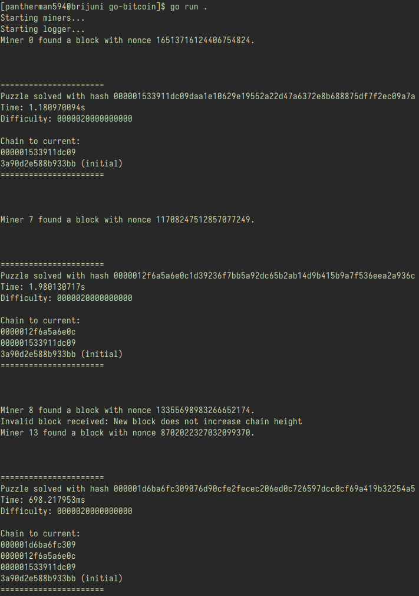

go-bitcoin
=====

_Bitcoin-inspired miner and tamper-resitant-log written in go_

David Shen, Jack Wiseman, Joon Park

Description
-----------

**go-bitcoin** uses goroutines to communicate between a number of miners and
a central logger that maintains a tamper-reistant log. The miners attempt to
solve a given hash puzzle by finding a nonce that creates a hash value less
than a certain target, and the logger validates it, adds it to its chain, and
relays it to the other miners.

This program keeps running once started, without any set end. Statuses are
printed whenever a block is successfully mined, but to quit the program you
can press Ctrl+C.

Usage
-----

In a terminal, run:

`go run . [-n miners] [-d difficulty] [-faulty] [-debug]`

Options
-------

#### -n _miners_

The number of miners in the network. (default 20)

#### -d _difficulty_

The difficulty, higher is easier, where the hash must be less than or equal to 2^_difficulty_. Max value is 255. (default 233)

#### -faulty

Simulates faulty miners (sending repeat solutions, setting an invalid previous hash, sending an unsolved puzzle, setting an incorrect difficulty, and sending a falsely "valid" block).

#### -debug

Enables extra debug printing.

Example runs
------------



How it works
------------

### Overview


### Data Structures

#### uint256

An array of 4 64-bit integers, used to store hash values in big-endian format.

#### BlockData

The hashable data in a block.

```
type BlockData struct {
	version       int32
	hashPrevBlock uint256
	data          int8
	difficulty    uint8
	nonce         uint64
}
```

- `version` is the current version of the block data structure.
- `hashPrevBlock` is the hash of the previous block.
- `data` can be used to store the data of the block. For now it stores the name
of the miner that successfully mined the block.
- `difficulty` stores the difficulty of the block.
- `nonce` stores the nonce used to solve the block.

#### Block

The extra data in a block, that will not be hashed.

```
type Block struct {
	BlockData
	valid     bool
	height    uint64
}
```

- `BlockData` integrates the fields and methods of BlockData into the current
struct. these can be referenced directly, but the hash functions will only
act on that data.
- `valid` stores whether the solution is valid.
- `height` stores the current height of the chain up to this block.

#### Logger

```
type Logger struct {
	blocks    map[uint256]Block
	lastTime  time.Time
	bestChain uint64

	minWorkRequired uint256
	recvBlock       chan Block
	sendBlocks      []chan Block
}
```

- `blocks` is a map of hash values to the corresponding blocks.
- `lastTime` stores the time since the last block was mined.
- `bestChain` contains the length of the longest chain.
- `minWorkRequired` stores the minimum work, i.e. the maximum target hash.
- `recvBlock` is the channel used to receive blocks from the miners.
- `sendBlocks` contains the channels of all the miners, to send completed blocks.

#### Miner

```
type Miner struct {
	name int8

	nonceOffset         uint64
	transactionsUpdated uint64

	recvBlock chan Block
	sendBlock chan Block
}
```

- `name` contains the name of the miner.
- `nonceOffset` contains the random offset for nonce searching.
- `transactionsUpdated` stores the number of blocks received. An update to this
number signals the miner to abandon the current block and start a new one.
- `recvBlock` is the channel used to receive blocks from the logger. This
corresponds to one of the logger's `sendBlocks`.
- `sendBlock` is the channel used to send solutions to the logger. This
corresponds to the logger's `recvBlock`.

### Files

#### main.go

[main.go](main.go) is the main command file. Its sole purpose is to parse commandline arguments
and start the [miners](miner.go) and [logger](logger.go).

#### block.go

[block.go](block.go) defines the Block struct and toBytes() function, which converts the Block into a slice of bytes. The hash() function implements the toBytes() function to hash the data in the Block using sha-256.

#### uint256.go

[uint256.go](uint256.go) defines the uint256 type, which stores a 256-bit integer for the hash value. This uses an array of 4 64-bit integers internally, and also contains useful functions to create, manipulate, compare, and output these values.

#### miner.go

[miner.go](miner.go) has the primary code and functions for the miners. The Start() function begins listening for new blocks. These blocks are hashed and used as the previous hash for a new puzzle, and the mining process begins in the mineBlock() function. Each miner starts with a random Uint64 value, which will be the starting nonce. The nonce then increments, and each iteration is double-hashed using SHA-256 and tested for validity against the target hash. This double hashing emulates the bitcoin code, and is [helpful](https://bitcoin.stackexchange.com/questions/6037/why-are-hashes-in-the-bitcoin-protocol-typically-computed-twice-double-computed) in protecting against [length extension attacks](http://en.wikipedia.org/wiki/Length_extension_attack).

#### logger.go

[logger.go](logger.go) contains the code for the logger. This sends out an initial block, and then listens for solutions. When one is received and verified to be new and correct, it is added to the `blocks` map which contains all received hash es and blocks. If the new block creates the new longest chain, it is relayed to all the miners for a new puzzle.

### Similarities to [bitcoin/bitcoin](https://github.com/bitcoin/bitcoin/tree/master/) and the [original implementation](https://github.com/bitcoin/bitcoin/tree/v0.1.5/)

_More details and line numbers are in the comments._

- Utilizes double hashing with sha-256 to prevent length extension attacks.
- If hash <= target, and no other miner has solved the current block, then the block is processed.
- If the tested hash does not meet target requirement, then the miner increments the nonce. From there, if nonce * 0x3ffff == 0, the network is tested to see if it is still operating. If all nonces have been checked, the mining process for the specific block ends. If a new block is proposed by the logger, the mining process for the specific block ends. Finally, block time is updated.
- During block processing, if the block already exists (the logger has already appended the block to the block chain), then the mining for the block ends. If the block is proven invalid, then the mining ends. If the block meets regulated requirements, then it is accepted.
- Block acceptance goes as follows: find the previous block; ensure current block follows previous block; block is added to map; pointer is set from current to previous block; the chain block is incremented; if the height is best (longest), then, the new block is broadcasted; update transaction count; store the block to disk; relay the now official block to other nodes/miners
